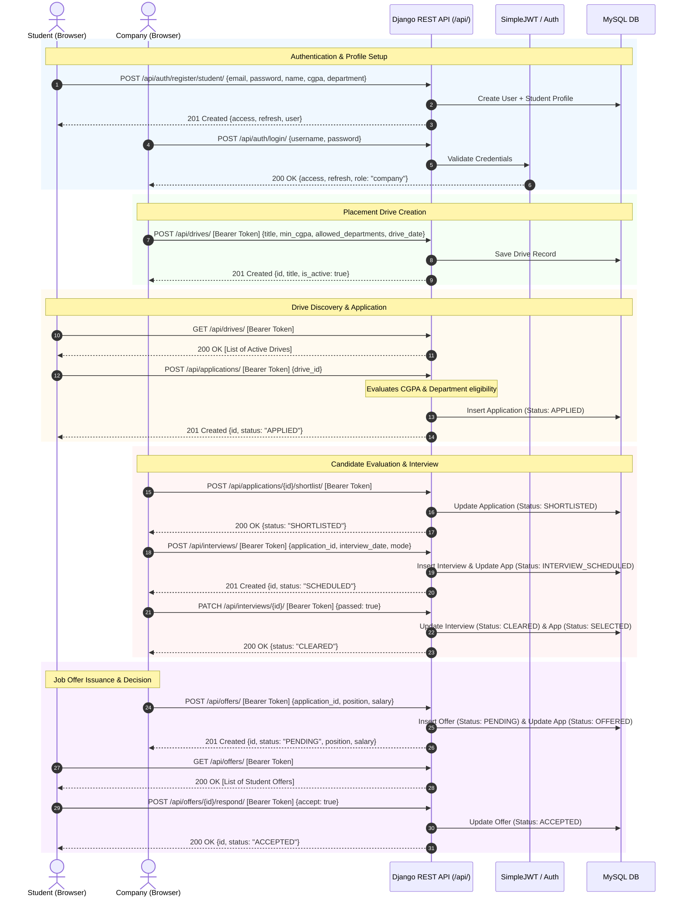

# REST API Contract & Flow Diagram

This diagram visualizes the sequential API contracts and interactions across the full recruitment lifecycle between the React Frontend, Django REST API, and backend services.

---

## 1. End-to-End Recruitment Workflow Sequence

---

## 2. API Endpoint Catalog

| Method | Endpoint | Access Role | Description |
| :--- | :--- | :--- | :--- |
| `POST` | `/api/auth/register/student/` | Public | Register new student account and academic profile |
| `POST` | `/api/auth/register/company/` | Public | Register new recruiter account and company profile |
| `POST` | `/api/auth/login/` | Public | Authenticate user credentials and return JWT tokens |
| `POST` | `/api/auth/refresh/` | Public | Refresh expired access token using refresh token |
| `GET` | `/api/auth/me/` | Authenticated | Fetch current user session details and profile |
| `GET` | `/api/students/profile/` | Student | Retrieve student academic profile |
| `PATCH`| `/api/students/profile/` | Student | Update student profile information |
| `GET` | `/api/companies/profile/`| Company | Retrieve company profile |
| `PATCH`| `/api/companies/profile/`| Company | Update company profile information |
| `GET` | `/api/drives/` | Authenticated | List all active placement drives |
| `POST` | `/api/drives/` | Company | Create a new campus placement drive |
| `GET` | `/api/drives/{id}/` | Authenticated | Retrieve details for a specific drive |
| `PATCH`| `/api/drives/{id}/` | Company | Update drive details, deadline, or active status |
| `GET` | `/api/applications/` | Authenticated | List user applications or company drive applicants |
| `POST` | `/api/applications/` | Student | Apply to a placement drive with eligibility validation |
| `GET` | `/api/applications/{id}/` | Participant | Retrieve comprehensive application details |
| `POST` | `/api/applications/{id}/shortlist/` | Company | Transition application status to SHORTLISTED |
| `POST` | `/api/applications/{id}/reject/` | Company | Transition application status to REJECTED |
| `GET` | `/api/interviews/` | Authenticated | List student's or company's scheduled interviews |
| `POST` | `/api/interviews/` | Company | Schedule interview for shortlisted candidate |
| `PATCH`| `/api/interviews/{id}/` | Company | Record interview outcome (passed: true/false) |
| `GET` | `/api/offers/` | Authenticated | List student's received or company's extended offers |
| `POST` | `/api/offers/` | Company | Extend formal job offer to cleared candidate |
| `POST` | `/api/offers/{id}/respond/` | Student | Accept or decline extended job offer |
| `GET` | `/api/health/` | Public | Health check reporting DB engine and API status |
