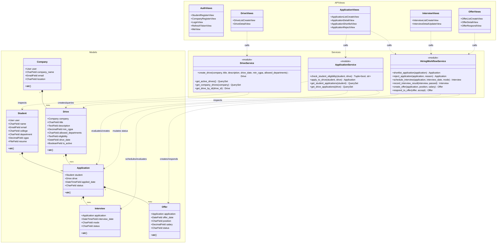

# Python Class & Module Diagram

This diagram documents the Object-Oriented module hierarchy and dependencies within the Django backend (`hiring/` application).

---

## 1. Class & Module Architecture

---

## 2. Structural Principles

1. **Separation of Concerns**: HTTP parsing, authentication checks, and JSON rendering live in the `hiring.api` views; all core validation and business decisions live in `hiring.services`.
2. **Encapsulated Workflow Transitions**: Status changes are guarded by `WorkflowError` in `hiring_workflow_service.py` to prevent out-of-sequence operations (e.g., offering before interview clearance).
3. **Decoupled Serializers**: Serializers in `hiring.schemas` handle bidirectional transformations between JSON payloads and model instances.
