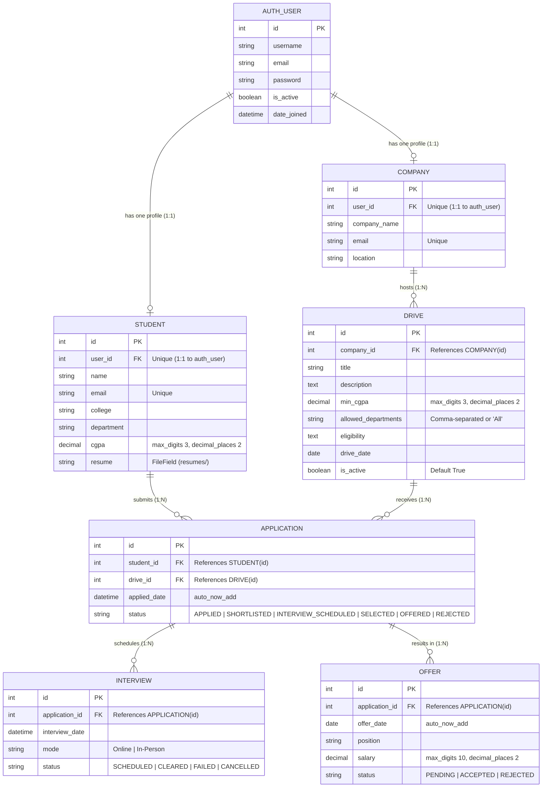

# Entity-Relationship (ER) Diagram

This diagram represents the relational data model for the **Campus & Internship Hiring Platform**, matching the actual MySQL database schema and Django ORM models.

---

## 1. Relational Schema & Entity Diagram

---

## 2. Entity Descriptions & Constraints

### 1. `auth_user` (Django Auth)
- Built-in authentication table handling user credentials, password hashes (PBKDF2/argon2), and active state.

### 2. `Student` (`hiring_student`)
- Stores student identity, academic credentials, and uploaded resume document.
- Linked one-to-one with `auth_user`.
- Enforces unique email constraint.

### 3. `Company` (`hiring_company`)
- Stores enterprise profile and recruitment point-of-contact details.
- Linked one-to-one with `auth_user`.
- Enforces unique email constraint.

### 4. `Drive` (`hiring_drive`)
- Campus recruitment drives posted by companies.
- Defines criteria: `min_cgpa` and `allowed_departments` checked during application submission.
- Foreign key: `company_id` (`ON DELETE CASCADE`).

### 5. `Application` (`hiring_application`)
- Relates a student to a drive they have applied for.
- **Unique Constraint**: `UniqueConstraint(student, drive)` strictly prevents duplicate submissions.
- Managed by finite-state transitions in `hiring_workflow_service`.

### 6. `Interview` (`hiring_interview`)
- Scheduled interviews associated with an application.
- Foreign key: `application_id` (`ON DELETE CASCADE`).
- Tracks date/time, mode (`Online` / `In-Person`), and outcome (`SCHEDULED`, `CLEARED`, `FAILED`, `CANCELLED`).

### 7. `Offer` (`hiring_offer`)
- Employment offer extended to candidates who successfully clear interviews.
- Tracks CTC/salary, job role title, and student decision (`PENDING`, `ACCEPTED`, `REJECTED`).
