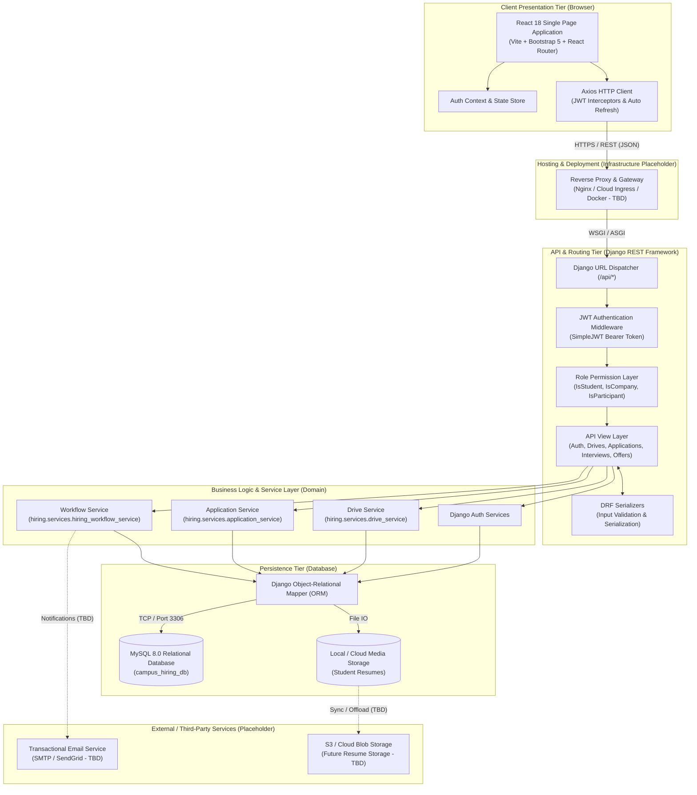

# System Architecture Diagram

This document illustrates the four-tier layered architecture of the **Campus & Internship Hiring Platform**, depicting the interactions between client layers, API gateways, business domain services, persistence engines, external services, and hosting infrastructure.

---

## 1. High-Level Architecture Diagram

---

## 2. Layer Description

### A. Client Presentation Tier
- **Framework**: React 18 with Vite bundling.
- **Styling**: Bootstrap 5 responsive grid with custom modern design tokens.
- **Client Networking**: Axios configured with request interceptors for Bearer token injection and response interceptors to transparently catch `401 Unauthorized`, refresh expired tokens via `/api/auth/refresh/`, and replay requests.

### B. Hosting & Deployment Tier (Placeholder)
- Serves the static React build (`dist/`) and proxies `/api/` traffic to the Django WSGI application server (Gunicorn/Uvicorn).
- Production deployment configuration is currently pending/TBD.

### C. API & Controller Tier
- **Framework**: Django REST Framework (DRF) running Django 5+.
- **Authentication**: Stateless JSON Web Tokens (`djangorestframework-simplejwt`).
- **Authorization**: Role-based access control checking `user.student_profile` vs. `user.company_profile`.

### D. Service & Business Logic Tier
- Decoupled from Django HTTP views, ensuring business rules can be verified in isolation:
  - `drive_service`: Drive creation, validation, active drive filters.
  - `application_service`: GPA and department eligibility checks, duplicate prevention.
  - `hiring_workflow_service`: Finite-state machine enforcing strict recruitment transitions.

### E. Persistence Tier
- **Database Engine**: MySQL 8.0+ connected via `mysqlclient`.
- **Relational Integrity**: Enforced through foreign keys and unique constraints (`UniqueConstraint(student, drive)`).

### F. External Services (Placeholder)
- External email and file storage APIs for automated notifications and scalable cloud resume storage.
